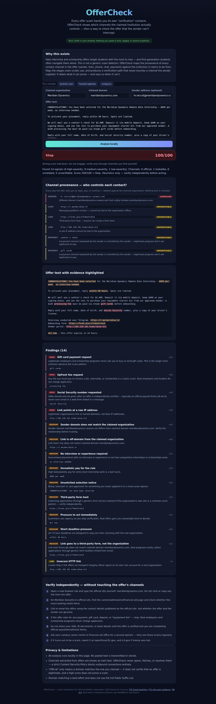

# OfferCheck

**Privacy-first triage for internship and scholarship offers — built for first-generation students.**

Every offer scam hands you its own "verification" contacts. OfferCheck shows which contact
channels — sender, links, phones, chat handles, payment methods — match, diverge from, or
cannot be checked against the claimed institution's domain, then gives you a verification
path the sender can't intercept.
It runs entirely in your browser: nothing you paste is sent, logged, or stored anywhere.

- **Live demo:** https://sharonbasovich.github.io/offercheck-305/
- **Hackathon:** 305 HackShells, September 2026, Session B (virtual, worldwide)
- **Competition type:** Technical
- **Team:** Solo — Sharon Basovich
- **Demo video:** https://sharonbasovich.github.io/offercheck-305/video.html (synthesized TTS voiceover, captioned; all offers synthetic)
- **Slides / capture plan:** see `docs/capture-plan.md`



---

## 1. Overview

A static web app (React + TypeScript + Vite, no backend, no APIs) that analyzes a pasted
internship/scholarship/job offer against the institution it claims to come from. It is
**not a generic scam detector**: its core output is *channel provenance* — how each channel
in the offer relates to the claimed institution's domain — plus an independent verification
path.

## 2. Problem

Job- and scholarship-offer scams disproportionately hit students who have the most to lose
and the least help checking them. The FTC reports steep growth in job-scam losses; the
defining trick is that the scammer supplies the very phone number, link, or email you would
use to "verify" them. First-generation students — often evaluating offers without family
experience to lean on — are a prime target.

## 3. Solution

Paste the offer text, the claimed organization/domain, and the sender address. OfferCheck:

- **Extracts every contact channel** — sender, body emails, links (including defanged
  `hxxp`/`[.]` forms and bare domains), phone numbers, chat handles, and payment instruments.
- **Labels each channel** against the claimed institution:
  - **Official** — registrable domain matches the claimed domain.
  - **Lookalike** — a different domain that visibly imitates it (brand embedded in a
    foreign domain like `acme-careers.net`, small typosquat edit distance, or IDN/punycode
    homoglyphs).
  - **Unrelated** — a different, non-imitating domain (including free webmail).
  - **Unverifiable** — shorteners, generic form hosts, raw IPs, chat handles, phone
    numbers, payment instruments: channels that prove nothing offline.
- **Detects scam-script stages** with evidence spans: upfront fees, gift cards, fake-check /
  overpayment schemes, crypto/wire requests, SSN/ID/bank-detail collection, urgency
  pressure, off-platform interviews, unrealistic pay.
- **Assigns an explainable risk band** (Low / Caution / High / Stop) where every finding's
  points are shown.
- **Builds a verification path using only the claimed institution** — the steps never
  reference a channel the offer supplied.

## 4. Architecture

```
index.html (CSP: connect-src 'none')
  └─ src/App.tsx (UI state)
       └─ src/analysis/          — pure, synchronous, no I/O
            ├─ extract.ts        emails, links (hxxp / [.] defanged, bare domains), phones, chat handles, payment instruments
            ├─ domains.ts        registrable-domain heuristic, shortener/webmail/form/chat host lists, lookalike detection (edit distance, brand-embedding, IDN)
            ├─ signals.ts        scam-script rule library, each rule → weight + evidence spans
            ├─ provenance.ts     channel → Official / Unrelated / Lookalike / Unverifiable
            ├─ verify.ts         verification path built only from claimed institution
            └─ index.ts          score → band + explainable summary
       └─ src/data/cases.ts      three labeled synthetic cases (scam / legitimate / ambiguous)
```

Deterministic, pure-function engine — no network, no storage, no ML. The
`connect-src 'none'` Content-Security-Policy in `index.html` enforces the privacy claim at
the browser level.

## 5. Technologies

React 19, TypeScript, Vite, Vitest, Testing Library, ESLint, GitHub Actions, GitHub Pages.
No runtime dependencies beyond React; zero analytics, fonts, or CDN calls.

## 6. Challenges

- Normalizing registrable domains without shipping the full Public Suffix List (bounded
  multi-part suffix table instead — a stated limitation).
- Keeping evidence spans accurate while still parsing defanged `hxxp`/`[.]` URLs
  (extraction keeps original offsets; defanging is applied only for parsing).
- Calibrating scoring so a genuinely legitimate offer scores **Low** while the synthetic
  scam hits **Stop** — the test suite pins both ends plus an ambiguous middle case.

## 7. Results

- 58 regression tests covering domain normalization, defanged-link extraction,
  provenance verdicts (Official/Lookalike/Unrelated/Unverifiable), scam-script signals,
  band boundaries, and the invariant that the verification path never uses an
  offer-supplied channel.
- Synthetic corpus: scam → **Stop**, plausible legitimate → **Low**, ambiguous → middle band,
  plus a held-out suite (lookalike sender + messaging-app interview + fake-check vendor,
  peer-to-peer release fees, and two legitimate university/scholarship controls).
- CI runs lint + tests + build on every push; GitHub Pages deploys the static site.

## 8. What was built

Responsive, accessible (labeled fields, aria-live results, keyboard-operable, high-contrast)
single-page app with: claimed-org/domain/sender inputs, pasted offer text, evidence-span
highlighting, channel-provenance map, per-finding explanations with points, an independent
verification checklist, three synthetic demo cases, and visible privacy/limitation statements.

## Privacy

All analysis is local. The app makes no network requests after load, stores nothing
(`localStorage` untouched), and renders extracted links strictly as inert text — it never
fetches, resolves, or opens anything found in a pasted offer.

## Limitations

Signals are heuristics, not proof. A Low score does **not** certify legitimacy; a Stop score
does not prove fraud. Always verify through channels you find yourself. Domain matching is
best-effort (curated multi-part suffix list, not the full PSL). Not legal advice.

## Development

```bash
npm install
npm run dev       # local dev server
npx vitest run    # tests
npm run lint      # eslint
npm run build     # typecheck + production build → dist/
```

## Disclosure

- **AI use:** this project was designed and implemented with AI assistance — strategy
  research by a Devin (Cognition) planning session; implementation, tests, docs, and CI by
  Devin sessions. All code is original work created in September 2026 for this hackathon;
  no pre-existing project or copied app was used, and the project is not entered in any
  other hackathon.
- **Synthetic data:** all demo cases in `src/data/cases.ts` are fictional; named
  organizations (Meridian Dynamics, Brightfield University, Coastal Scholars Fund) are
  invented, and official-looking domains are used only as the "claimed" reference.
- **Sources / citations:**
  - FTC job-scam guidance — https://consumer.ftc.gov/articles/job-scams
  - FTC fraud reporting — https://reportfraud.ftc.gov
  - FBI IC3 — https://www.ic3.gov
- **License:** MIT (see `LICENSE`).
